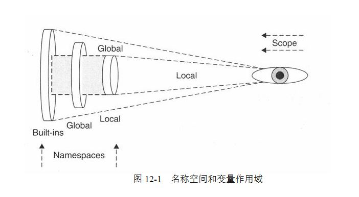

# Python Basic

- [Useful Command](#useful-command)
- [Python Coding Best Practice](#python-coding-best-practice)
  - [PEP 8 - Style Guide for Python Code](#pep-8---style-guide-for-python-code)
- [Python IDE](#python-ide)
- [Debug](#debug)
  - [How can I debug a python code in a virtual environment using VSCode](#how-can-i-debug-a-python-code-in-a-virtual-environment-using-vscode)
- [Python 多版本共存](#python-多版本共存)
- [包管理工具 Package Manager](#包管理工具-package-manager)
  - [pip](#pip)
  - [Pipfile](#pipfile)
- [包管理仓库](#包管理仓库)
  - [PyPI](#pypi)
  - [TestPyPI](#testpypi)
  - [How to Packaging and Publish to Package Repository](#how-to-packaging-and-publish-to-package-repository)
- [虚拟环境管理](#虚拟环境管理)
  - [Why 虚拟环境？](#why-虚拟环境)
  - [pipenv](#pipenv)
  - [virtualenv](#virtualenv)
  - [poetry](#poetry)
  - [conda](#conda)
    - [Install conda in MacOS](#install-conda-in-macos)
    - [Install conda in Linux](#install-conda-in-linux)
    - [Create conda env](#create-conda-env)
    - [Manage packages in conda env](#manage-packages-in-conda-env)
- [Namespace \& Scope](#namespace--scope)
- [数据类型](#数据类型)
  - [String](#string)
  - [List](#list)
  - [Dictionary](#dictionary)
  - [Tuple](#tuple)
  - [Set](#set)
  - [mutable vs immutable](#mutable-vs-immutable)
- [Functions](#functions)
- [Jupyter Notebook](#jupyter-notebook)
- [运行一个简单的本地 HTTP 服务器](#运行一个简单的本地-http-服务器)
- [Unit Testing](#unit-testing)
- [代码风格 PEP 8](#代码风格-pep-8)
- [Reference](#reference)

## Useful Command

- help

Type help() for interactive help, or help(object) for help about object.

```py
> python
>>> help()
>>> help('string')
>>> help('list')
type(obj)
dir(obj)

```

## Python Coding Best Practice

- Defining Python Source Code Encodings at the top

    ```py
    # coding=utf8
    ```

- Print with () to support both 2.7* and 3.* version

- urllib PY2 and urllib.request PY3

    ```py
    import sys
    if sys.version < '3':
        import urllib

    else:
        import urllib.request as urllib

    ```

### PEP 8 - Style Guide for Python Code

https://www.python.org/dev/peps/pep-0008/

https://www.python.org/dev/peps/pep-0020/

- 代码的可读性很重要

### Type Hints 类型注解 

https://peps.python.org/pep-0484/

## Python IDE

- Spyder
- [PyCharm](https://www.jetbrains.com/pycharm/download)
- [Wing Python IDE](https://wingware.com)
- IDLE

## Debug

http://stackoverflow.com/questions/4929251/can-you-step-through-python-code-to-help-debug-issues


### How can I debug a python code in a virtual environment using VSCode

Make sure the environment you want to use is [selected in the Python extension for VS Code](https://code.visualstudio.com/docs/python/environments) by running the `Select Interpreter` command or via the status bar. Otherwise you can explicitly [set the Python interpreter to be used when debugging](https://code.visualstudio.com/docs/python/debugging#_python) via the `python` setting for your debug config.


## Python 多版本共存

```sh

brew install pyenv
pyenv -v
pyenv install 3.7.0
pyenv install 3.9.13
pyenv versions

#切换版本
pyenv global 3.9.13
pyenv versions
python --version


```

## 包管理工具 Package Manager

### pip

```sh

pip config set global.index-url https://pypi.tuna.tsinghua.edu.cn/simple
pip install -r requirements.txt

#or

pip install --index-url https://pypi.tuna.tsinghua.edu.cn/simple -r requirements.txt 

# 生成 requirements.txt
pip freeze > requirements.txt

```

### Pipfile

New standard, which will replace requirements.txt.

```sh
$ cat Pipefile

[[source]]
url = "https://pypi.tuna.tsinghua.edu.cn/simple"
verify_ssl = true
name = "pypi"

[packages]
confluent-kafka = "==1.7.0"
numpy = "==1.21.1"
pandas = "==1.3.1"
matplotlib = "==3.4.2"
pika = "==1.2.0"
boto3 = "==1.18.19"
faker = "==8.11.0"
requests = "*"

[dev-packages]

[requires]
python_version = "3.11"

```

## 包管理仓库

### PyPI

The Python Package Index (PyPI) is a repository of software for the Python programming language.

### TestPyPI

Test Python package publishing with the Test Python Package Index <https://test.pypi.org/>

### How to package and publish to Package Repository

```sh

# https://packaging.python.org/en/latest/tutorials/packaging-projects/
py -m build

twine upload --repository testpypi dist/*

pip install -i https://test.pypi.org/simple/ python_basic
# https://test.pypi.org/project/python-basic/0.0.6/
```

## 虚拟环境管理

VSCode Plugin： Python Environment Manager

### Why 虚拟环境？

### pipenv

https://pypi.org/project/pipenv/

- Install `pip install pipenv`

```sh
# 创建虚拟环境
pipenv install

#  Output virtualenv information. 
pipenv --venv

# 激活虚拟环境
pipenv shell


# 安装requests 包
pipenv install requests
# pipenv也可以通过requirements.txt安装包
pipenv install -r requirements.txt

pipenv run python foo.py

```

### virtualenv

Create isolated 'Python Homes' for packages to be installed in, one for each project.

```sh

pip3 install virtualenv

```

### poetry

- Install `pip install poetry`

```sh

# Add Poetry to an existing project.
poetry init

# 创建虚拟环境
poetry install
# 多版本共存下，指定python 版本
poetry env use python3.7

# 激活虚拟环境
$ poetry shell
# 查看虚拟环境信息
$ poetry env info
# 显示虚拟环境列表
$ poetry env list

#安装依赖包
# 解析并安装pyproject.toml里指定的依赖包
poetry install

# Add a package to pyproject.toml and install it.
poetry add `cat requirements.txt`
poetry add ***

# 区分不同环境的依赖包
poetry add pytest --dev

poetry show

# Create requirements.txt From poetry.lock
poetry export --without-hashes --without-urls --output requirements.txt

```

### conda

#### Install conda in MacOS

```shell
brew install --cask miniconda
```

#### Install conda in Linux

```shell
curl -LO https://repo.anaconda.com/miniconda/Miniconda3-latest-Linux-x86_64.sh
sh Miniconda3-latest-Linux-x86_64.sh
```

conda config --add channels https://mirrors.tuna.tsinghua.edu.cn/anaconda/pkgs/free/
conda config --set show_channel_urls yes

#### Create conda env

conda create -n python_crawler python=3.11.0

conda activate python_crawler

conda deactivate

conda env list

#### Manage packages in conda env

conda install beautifulsoup4

conda list -e > requirements.txt

## Namespace & Scope



## 数据类型

### String

unicode

book='hacker and painter'
print(book[0:6])

### List

```py
['cat','dog']
```

Python does not have built-in support for **Array**, but Python lists can be used instead.

```py
cars = ["Ford", "Volvo", "BMW"]

print(cars[0])
```

### Dictionary

A dictionary is a collection which is unordered, changeable and indexed. In Python dictionaries are written with curly brackets, and they have keys and values.

- [Dictionary Example Code](./dictionary.py)

### Tuple

```py
('a','b','c')
```

[打包和解包 tuple](http://www.ibm.com/developerworks/cn/opensource/os-python2/ )

### Set

frozenset

### mutable vs immutable

list(列表)可以通过引用其元素，改变对象自身(in-place change)。这种对象类型，称为可变数据对象(mutable object)，词典也是这样的数据类型。

元组(tuple)尽管可以调用引用元素，但不可以赋值，因此不能改变对象自身，称为不可变数据对象(immutable object)。

## Functions

- [Functions Example](samples/functions.py)

## Jupyter Notebook

```sh
pip3 install --upgrade pip
pip3 install jupyter

# Run the notebook
jupyter notebook
# How do I open a specific Notebook
jupyter notebook jupyter-notebook.ipynb

```

## 运行一个简单的本地 HTTP 服务器

```py
    python -m http.server
```

## Unit Testing

- pytest

## 代码风格 PEP 8

pip install pycodestyle
pycodestyle file.py

<!-- 程序 autopep8 能自动将代码格式化 成 PEP 8 风格 -->
pip install autopep8
autopep8 --in-place file.py


## Reference

[1] <https://www.python.org/>

[2] <https://pypi.org/>

[3] <https://ocw.mit.edu/courses/6-0001-introduction-to-computer-science-and-programming-in-python-fall-2016>

[4] [Full Stack Python](https://www.fullstackpython.com/)

[5] <https://docs.python-guide.org/writing/structure/>

[6] <https://docs.djangoproject.com>

[7] [Status of Python versions](https://devguide.python.org/versions/)

[8] [PEP 8 — the Style Guide for Python Code](https://pep8.org)

[9] [Real Python]<https://realpython.com/>

[10] [Real Python Youtube Channel]<https://www.youtube.com/c/realpython>

